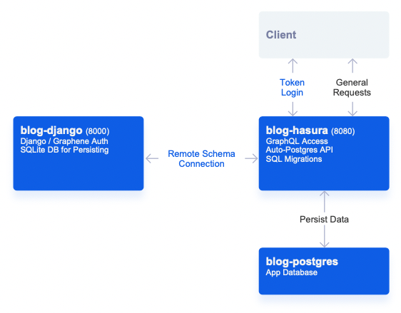
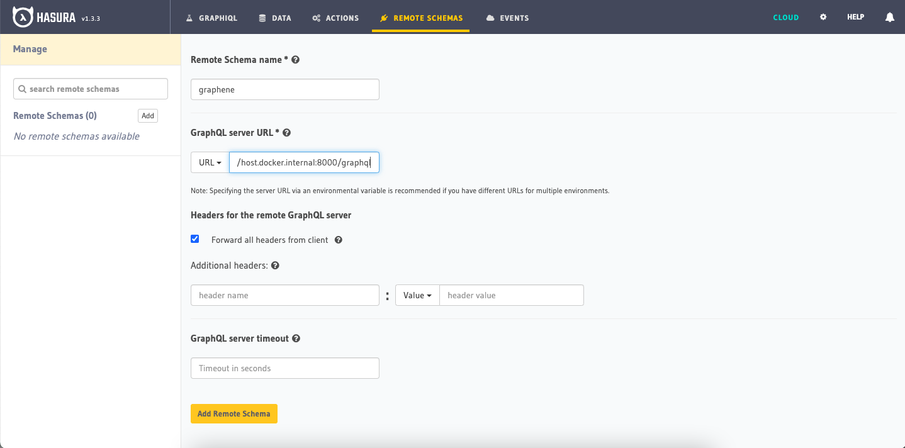
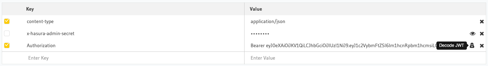

# Going Remote: Django Graphene (GraphQL) JWT & Hasura Remote Schemas

Hasura has a great feature of being able to merge in external GraphQL schemas, allowing us to do things like stitch together a mesh of services powered by GraphQL.

In this walkthrough, we're going to go through creating a simple GraphQL authentication service using Django Graphene, meshing it into your Hasura service, and creating a few sample requests.

## Getting Started
Similar to the Food Network, we can start this off by taking a look at what the final project looks like.

If you pull down this **(TODO: add GitHub link)** project, and run:
```bash
docker-compose up
```
on the directory, you'll receive a setup like the following:



**Pro Tip**: If you look in the `docker-compose.yml` you'll notice we're using the image `hasura/graphql-engine:latest.cli-migrations-v2`. 

This migrations image will automatically apply our Hasura metadata (connected remote schema, tracked tables, permissions) as well as our SQL migrations (to generate our schema) from the `./hasura` folders which are mounted as volumes in our docker-compose file.

Migrations are a super-powerful way to work with Hasura instances, and I highly recommend them as a way to work through your deployment work-flow (more info: https://hasura.io/docs/1.0/graphql/core/migrations/index.html)

## The Django Service
If we take a look at the `./django/dockerfile` you'll see that we're running a standard Python 3 container with:
```bash
pip install django-graphql-jwt django
```
initiated (`django-graphql-jwt` is the package we'll be using as a helper with this project and it comes with `graphene-django` and `PyJWT` as dependencies - your can read more about this package here: https://github.com/flavors/django-graphql-jwt).

We've also pinned `PyJWT` to `< 2` as there's a compatibility issue with the current `django-graphql-jwt` and the latest major version of `PyJWT`. 

If you look at the project structure in the `./django` folder you'll notice it's the same as if we had run:
```bash
django-admin startproject app 
```
and then:
```bash
python manage.py startapp api
```
from within our project.

We're going to be putting our global settings in `app` and then our API specific functions in `api`.

We've also automatically run make and run migrations in the `./django/entrypoint.sh` on each container startup.

## Project Setup
Let's take a look at what we've added to our `./django/app/settings.py` file:

### ./django/app/settings.py
```python
...
# Lets us load our secret from our docker-compose env variables
SECRET_KEY = os.environ['DJANGO_SECRET']
...
# Make sure our Django instance is accessible locally
ALLOWED_HOSTS = ['localhost', 'host.docker.internal']
...
INSTALLED_APPS = [
    'django.contrib.admin',
    'django.contrib.auth',
    'django.contrib.contenttypes',
    'django.contrib.sessions',
    'django.contrib.messages',
    'django.contrib.staticfiles',
# We're going to load:
# - Graphene
# - Optional refresh_token to use a token / refresh scheme in our API
# - Our api app (which contains our API functions)
    'graphene_django',
    'graphql_jwt.refresh_token.apps.RefreshTokenConfig',
    'api',
]
...
# We're going to use an external SQLite DB for this demo, but if you wanted to use the same Postgres as your app DB, you would use similar to the below and this DB would be accessible in Hasura:
DATABASES = {
    'default': {
        'ENGINE': 'django.db.backends.sqlite3',
        'NAME': BASE_DIR / 'db.sqlite3',
    },
    # 'default': {
    #     'ENGINE': 'django.db.backends.postgresql',
    #     'NAME': 'postgres',
    #     'USER': 'postgres',
    #     'PASSWORD': 'password',
    #     'HOST': 'blog-postgres',
    #     'PORT': '5432',
    # }
}
...
# Defines what Graphene settings and JWT middleware
# You'll notice we've defined the app.schema - we'll walk through a review of this below.
GRAPHENE = {
    'SCHEMA': 'app.schema.schema',
    'MIDDLEWARE': [
        'graphql_jwt.middleware.JSONWebTokenMiddleware',
    ],
}
...
# Defines JWT settings and auth backends
# You'll notice we've defined app.utils.jwt_payload - we'll be reviewing it below as well.
GRAPHQL_JWT = {
    'JWT_PAYLOAD_HANDLER': 'app.utils.jwt_payload',
    'JWT_AUTH_HEADER_PREFIX': 'Bearer',
    'JWT_VERIFY_EXPIRATION': True,
    'JWT_LONG_RUNNING_REFRESH_TOKEN': True,
    'JWT_EXPIRATION_DELTA': timedelta(minutes=5),
    'JWT_REFRESH_EXPIRATION_DELTA': timedelta(days=7),    
    'JWT_SECRET_KEY': os.environ['DJANGO_SECRET'],
    'JWT_ALGORITHM': 'HS256',
}
AUTHENTICATION_BACKENDS = [
    'graphql_jwt.backends.JSONWebTokenBackend',
    'django.contrib.auth.backends.ModelBackend',
]
```

In terms of setting up our JWT - we've gone with a short expiration time (5 minutes for our access token) and a longer time for our refresh token (7 days). 

In general, this setup works well in that we'll only use our refresh token for updating the expiration time on our access token, and our access token (which gives us access to our application) will frequently be refreshed in case of compromise.

You saw from the above that we've mentioned 2 other files, `app.utils` and `app.schema` - let's walk through those and look at what they're doing.

### ./django/app/utils.py
```python
import jwt
import api.models
from datetime import datetime
from graphql_jwt.settings import jwt_settings
    
## JWT payload for Hasura
def jwt_payload(user, context=None):
    jwt_datetime = datetime.utcnow() + jwt_settings.JWT_EXPIRATION_DELTA
    jwt_expires = int(jwt_datetime.timestamp())
    payload = {}
    payload['username'] = str(user.username) # For library compatibility
    payload['sub'] = str(user.id)
    payload['sub_name'] = user.username
    payload['sub_email'] = user.email
    payload['exp'] = jwt_expires
    payload['https://hasura.io/jwt/claims'] = {}
    payload['https://hasura.io/jwt/claims']['x-hasura-allowed-roles'] = [user.profile.role]
    payload['https://hasura.io/jwt/claims']['x-hasura-default-role'] = user.profile.role
    payload['https://hasura.io/jwt/claims']['x-hasura-user-id'] = str(user.id)
    return payload
```

We've got a utility function here to encode our Hasura JWT payload based on the spec at: https://hasura.io/docs/1.0/graphql/core/auth/authentication/jwt.html#the-spec

You'll notice we make reference to `api.models` and `user.profile.role` - that's a little different. 

Down below we're going to go over how to extend our user model - once you know how to do that you'll be able to extend your JWT payload further with any other `x-hasura...` claims your application requires.

### ./django/app/schema.py
```python
import graphene
import graphql_jwt
import api.schema

## Mutation: 
# - token_auth - for Login
# - refresh_token - for Token refresh
# + schema from api.schema.Mutation
class Mutation(api.schema.Mutation, graphene.ObjectType):
    token_auth = graphql_jwt.ObtainJSONWebToken.Field()
    refresh_token = graphql_jwt.Refresh.Field()
    verify_token = graphql_jwt.Verify.Field()    
    pass

## Query:
# + schema from api.schema.Query
class Query(api.schema.Query, graphene.ObjectType):
    pass

# Create schema
schema = graphene.Schema(query=Query, mutation=Mutation)
```

This sets up our root GraphQL schema file.

You'll notice we're declaring `token_auth`, `refresh_token`, and `verify_token` nodes which will be our default methods of logging in, refreshing our token's expiration, and verifying our token.

The will create mutations for those actions.

We also mention `api.schema` which contains the logic for our other query and mutation nodes which we'll be reviewing below.

## Extending the User Model
Before we get to setting up our GraphQL logic, a little housekeeping.

We want to define the role of our user. It's a really common paradigm in Django and there are a lot of ways to tackle adding more fields to your Django user.

The easiest way is to extend your user model with a one-to-one model. 

This creates a new table which has a relationship to Django's default user model.

### ./django/api/models.py
```python
from django.db import models
from django.db import models
from django.contrib.auth.models import User
from django.db.models.signals import post_save
from django.dispatch import receiver

# Create your models here.
active_roles=(
    ("user", "user"),
    ("manager", "manager")
)

class profile(models.Model):
    user = models.OneToOneField(User, on_delete=models.CASCADE)
    role = models.CharField(max_length=120, choices=active_roles, default="user")
    
@receiver(post_save, sender=User)
def create_user_profile(sender, instance, created, **kwargs):
    if created:
        profile.objects.create(user=instance)

@receiver(post_save, sender=User)
def save_user_profile(sender, instance, **kwargs):
    instance.profile.save()
```

What we're doing here is basically saying, each user has an associated `profile` row. Roles can be either `user` or `manager` (based on `active_roles`)- defaulting to `user`.

On creation of a new `user` - make sure they have a `profile` entry.

Just to make it nice, we can also add this relationship to our admin section - this will make this `profile` model available in our Django Admin (http://localhost:8000/admin/), under our default user model:

### ./django/api/admin.py
```python
from django.contrib import admin
from django.contrib.auth.admin import UserAdmin as BaseUserAdmin
from django.contrib.auth.models import User
from api.models import profile

# Register your models here.
# Inline + descriptor
class AdminProfileInline(admin.StackedInline):
    model = profile
    can_delete = False
    verbose_name_plural = 'profiles'

# Define new admin with inline
class ProfileUserAdmin(BaseUserAdmin):
    inlines = (AdminProfileInline,)

# Re-register UserAdmin
admin.site.unregister(User)
admin.site.register(User, ProfileUserAdmin)
```

## Setting Up Our Schema Functions
We've so far created our mutations for logging in, refreshing, and verifying our token using our root schema file.

You'll remember that we referenced `api.schema.Query` and `api.schema.Mutation` inside that root schema file.

Inside this schema file we'll be defining:
- A mutation for creating a new user, 
- A query for retrieving my own user profile
- Another query for retrieving all users 

with authentication restrictions for role and if the user is authenticated. 

### ./django/api/schema.py
```python
from django.contrib.auth import get_user_model
from graphene_django import DjangoObjectType
from api.models import profile
from graphql_jwt.shortcuts import create_refresh_token, get_token
import graphene
import graphql_jwt

## Mutation: Create User
# We want to return:
# - The new `user` entry
# - The new associated `profile` entry - from our extended model
# - The access_token (so that we're automatically logged in)
# - The refresh_token (so that we can refresh my access token)

# Make models available to graphene.Field
class UserType(DjangoObjectType):
    class Meta:
        model = get_user_model()

class UserProfile(DjangoObjectType):
    class Meta:
        model = profile

# CreateUser
class CreateUser(graphene.Mutation):
    user = graphene.Field(UserType)
    profile = graphene.Field(UserProfile)
    token = graphene.String()
    refresh_token = graphene.String()
    
    class Arguments:
        username = graphene.String(required=True)
        password = graphene.String(required=True)
        email = graphene.String(required=True)

    def mutate(self, info, username, password, email):
        user = get_user_model()(
            username=username,
            email=email,
        )
        user.set_password(password)
        user.save()

        profile_obj = profile.objects.get(user=user.id)        
        token = get_token(user)
        refresh_token = create_refresh_token(user)
        
        return CreateUser(user=user, profile=profile_obj, token=token, refresh_token=refresh_token)
    
# Finalize creating mutation for schema
class Mutation(graphene.ObjectType):
    create_user = CreateUser.Field()
  
## Query: Find users / my own profile  
# Demonstrates auth block on seeing all user - only if I'm a manager
# Demonstrates auth block on seeing myself - only if I'm logged in
class Query(graphene.ObjectType):
    whoami = graphene.Field(UserType)
    users = graphene.List(UserType)
    
    def resolve_whoami(self, info):
        user = info.context.user
        # Check to to ensure you're signed-in to see yourself
        if user.is_anonymous:
            raise Exception('Authentication Failure: Your must be signed in')
        return user
    
    def resolve_users(self, info):
        user = info.context.user
        print(user)
        # Check to ensure user is a 'manager' to see all users
        if user.is_anonymous:
            raise Exception('Authentication Failure: Your must be signed in')
        if user.profile.role != 'manager':
            raise Exception('Authentication Failure: Must be Manager')
        return get_user_model().objects.all()
```

## Tying It All Together
By visiting `urls.py`, we can ensure that our routes are setup to make our GraphQL API accessible to our Hasura instance.

### ./django/app/urls.py
```python
from django.contrib import admin
from django.urls import path
from django.views.decorators.csrf import csrf_exempt
from graphene_django.views import GraphQLView

urlpatterns = [
    path('admin/', admin.site.urls), # Exposes your django admin at http://localhost:8000/admin/
    path("graphql", csrf_exempt(GraphQLView.as_view(graphiql=False))),  # Exposes your django admin at http://localhost:8000/graphql
]
```

Now, if you're using the docker-compose starter you should already be setup with docker being connected to Hasura - but if not, you can make sure all your containers are running and visit: http://localhost:8080/console/remote-schemas/manage/schemas

From here, you'll be able to mesh your Graphene GraphQL API to Hasura by entering `http://host.docker.internal:8000/graphql` as your GraphQL Server URL:


## Testing Our Requests
Hasura has a great GraphiQL request tester which can be found here to run through some sample requests and responses - http://localhost:8080/console/api-explorer

### Creating a User

Let's get started with creating a user - we can see some of the nested relationship structures which are possible within GraphQL.

We've returned a `token` here -  this token will be available as our access token for the next 5 minutes.

```graphql
mutation createUser {
  createUser(username: "<your_username>", password: "<your_password>", email: "<your_email>") {
    refreshToken
    token
    user {
      username
    }
    profile {
      role
    }
  }
}
```

### Verify a Token

We're able to take any token created and test it using `verifyToken` to validate and receive the token's corresponding payload.

```graphql
mutation verifyToken {
  verifyToken(token: "<your_token>") {
    payload
  }
}
```


### Refreshing a Token

If our token expires, we're able to refresh the token using `refreshToken` - this will result in a response with a token with an updated expiry time (+ 5 minutes in this case).

```graphql
mutation refreshToken {
  refreshToken(refreshToken: "<refresh_token>") {
    token
  }
}
```

### Logging In

Logging in will also provide us with a token / refresh_token pair.


```graphql
mutation loginUser {
  tokenAuth(username: "<username>", password: "<password>") {
    token
    refreshToken
    payload
  }
}
```

### Using Graphene Authentication: Who Am I?
We've covered talking with our API to retrieve a `token` - but what do we do with it now?

If we create a new `Authorization` header, with `Bearer` followed by our token, we'll be able to authenticate as a user (pictured below).



We can also select the `Decode JWT` icon to the right of the field to help us analyze what's being decoded from our entered token.

Running the following query will run our `whoami` query 

```graphql
query whoami {
  whoami {
    email
  }
}
```

### Using Graphene Authentication: Manager Role
We've tested to make sure our role works, but next let's check to make sure our Manager role will work to show us all users.

We can create a Django Superuser using the following command to give us access to the Django Admin at http://localhost:8000/admin/ :

```bash
docker exec -it blog-django bash -c 'python manage.py createsuperuser'
```

From that admin panel if we update our user to the `manager` role and then re-login, we'll be able to see a view of **all** users by running:

```graphql
query userList {
  users {
    email
  }
}
```

## Where do we go from here?

To start we should start off by changing any secrets that are found in our `docker-compose.yml` file - you can create a new secret with the following: 
```bash
docker exec blog-django bash -c 'python -c "import secrets; print(secrets.token_urlsafe())"'
```

But what else can we do once we have an external Django auth service?
- We can create more remote schema nodes similar to `users` and `whoami` above to to extend our API's logic.
- We can link up our Django service to work with Actions and Events.
- We can use our JWT implementation to authenticate with our Hasura service and configure row-level permissions using our `x-hasura-...` JWT claims which were set in the JWT encoder.